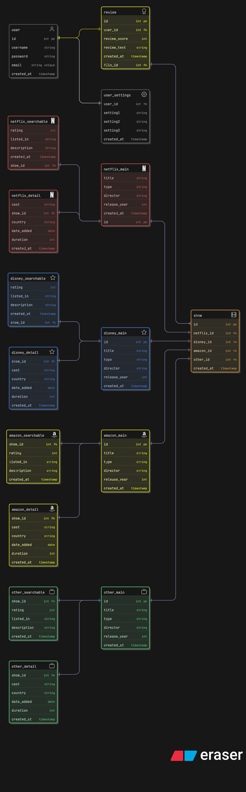

# Next Watch
Next Watch is a simple open source application designed to help useres find their next movie or tv series across Netflix, Disney+, and Amazon Prime Video.

## Features

- Search publicly available databases for movies and tv shows based on features like genre, director, country of origin, platform, and rating

- Leave reviews for movies and TV shows, influencing future searches

- Upload shows and movies from other platforms

## Installation

- Download repository

- Manually create database in local mysql server according to crows foot ER diagram

- Run shell command 'make' to make a build

## ER Diagram

## Usage

- make generates an executable file

## Video Demonstration

<iframe width="560" height="315"
src = "https://youtu.be/9yPoYn5vxrc"
title="Youtube video player"
frameborder="0">
</iframe>

## Used Datasets
Netflix Movies and TV Shows: https://www.kaggle.com/datasets/shivamb/netflix-shows

Disney+ Movies and TV Shows: https://www.kaggle.com/datasets/shivamb/disney-movies-and-tv-shows

Amazon Prime Movies and TV Shows: https://www.kaggle.com/datasets/shivamb/amazon-prime-movies-and-tv-shows

